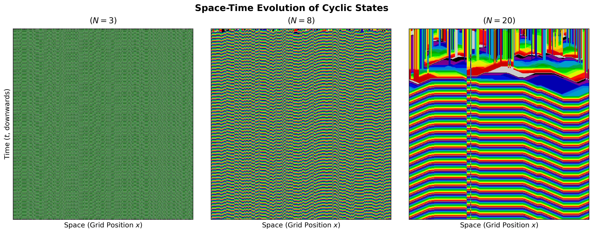

# Cyclic Cellular Automata (CCA)

This project explores the dynamics of cyclic cellular automata through visualization and analysis.

## Quick Access

- **[Interactive Visualization](cca.ipynb)** - View and run the animated cyclic cellular automaton simulations

## Visualizations

### Animated Simulations

#### N=3 States (High Entropy/Turbulence)

#### N=8 States (Transitional/Wave Nucleation)

#### N=20 States (Self-Organized Spirals)

### Analysis Diagrams

#### Phase Transition Behavior

#### Space-Time Evolution

